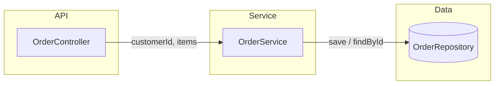

# Architecture Overview

## Components

- **OrderController** — REST entry point. Exposes create and lookup operations.
- **OrderService** — validates orders and delegates persistence.
- **OrderRepository** — persistence boundary for orders.
